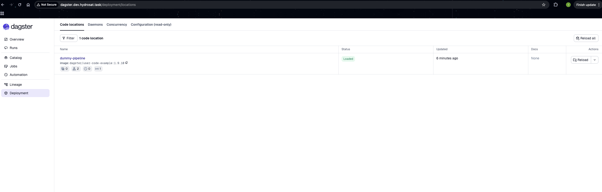
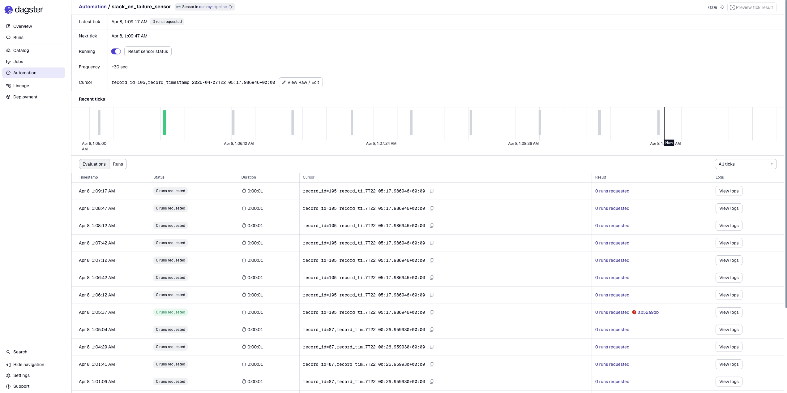
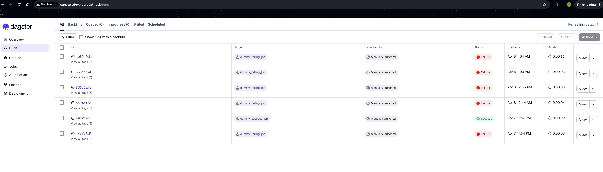
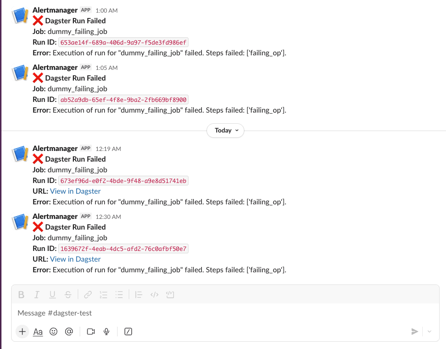

# How to Test

Validating infrastructure changes is crucial before applying them. Here is a brief description of how we ensure consistency and verify the configuration.

## Validation via Planning

Before executing `task apply`, it is strongly encouraged to run `task plan`. OpenTofu will read the current state of AWS and compare it against our code, generating an execution plan.

```bash
task plan -- <layer> <environment>
```
*Example: `task plan -- compute dev`*

**What to look for:**
- **Add/Change/Destroy:** Review the summary at the end of the plan output. Unexpected destructions (e.g., recreating a database) signal a potential issue with changing immutable identifiers (like cluster names).
- **In-place updates:** Changes like adding tags to a VPC should show as `updated in-place`.

## Naming & Tagging Audits

We enforce a standardized tagging model using a merged `combined_tags` variable in every stack.

During testing, we manually verify that:
1.  **Resource Naming:** Core resources follow the `[project]-[environment]-[region_short]-[resource]` pattern.
2.  **Required Tags:** All resources contain the mandatory tags defined in `envs/globals.tfvars` (e.g., `Project`, `ManagedBy`) and stack-specific tags.

## Development Quality Control & IaC Scanning

To maintain code quality, security, and consistent documentation automatically, we enforce **pre-commit** hooks across the repository.

### Prerequisites
You need to install the core tools that our hooks rely on:
```bash
# MacOS / Linux
brew install pre-commit terraform-docs checkov
```

### Enable Pre-commit Hooks
Once the tools are installed, set up the hooks in your local Git repository:
```bash
pre-commit install
```

When configured, every `git commit` will automatically:
1. Fix trailing whitespace and EOF newlines.
2. Verify YAML syntax.
3. Run `terraform fmt` to ensure uniform code style.
4. Run `terraform-docs` to auto-update the README.md in modified stack modules.
5. Run `checkov` to scan for security misconfigurations.

### Manual Execution
You can run isolated tools on specific layers using the Taskfile (e.g., `task docs-all` or `task checkov -- compute`).

## Functional Testing: End-to-End Alerting

Once the platform is provisioned, we perform a manual end-to-end test of the Dagster integration and our Slack failure sensors to guarantee operational readiness.

1. **Verify Code Location:** Navigate to the **Deployments** tab in the Dagster UI and ensure your connected user code location is "Loaded".

   
2. **Find the Test Job:** Go to the **Jobs** tab. Find the job named `dummy_failing_job` (which was specifically created for testing the alerting pipeline).
3. **Trigger the Job:** Click into the job, then click the **Launchpad** tab. Press **Launch Run** in the bottom right corner (no run configuration is needed).

   
4. **Monitor and Verify:** Navigate to the **Runs** tab to watch the execution. The job is designed to fail.

   

   Upon failure, it will immediately trigger our configured Slack sensor, and you will receive a notification with the error trace in your designated Slack channel.

   
