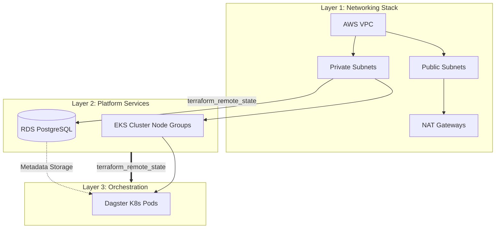

# Infrastructure Design

This document explains the core structure, the layered design, and the technical decisions that power our setup.

## The "Stack" Architecture

We utilize a modular, component-based "Stack" architecture. Instead of a monolithic Terraform state, the infrastructure is divided into logical, independently manageable *layers*. This approach ensures:
- **Isolation:** Changes in one layer (e.g., Dagster configuration) do not impact lower-level infrastructure (e.g., VPC).
- **Scalability:** Teams can work on different layers concurrently.
- **Maintainability:** Clear boundaries make it easier to audit and update specific components of platform.

### Layered Hierarchy & Dependency Flow

The infrastructure is provisioned strictly top-down. The diagram below illustrates both the physical AWS architecture and the Terraform state dependency flow between our Stacks.



1. **Networking Layer**: The foundational layer. Provisions the Virtual Private Cloud (VPC), public and private subnets, routing, NAT Gateways, etc.
2. **Compute Layer**: Provisions the AWS Elastic Kubernetes Service (EKS) cluster. Engineered for cost-efficiency using `t3.small` SPOT instances, and secured with private nodes and IRSA (IAM Roles for Service Accounts).
3. **Database Layer**: Provisions the Amazon RDS PostgreSQL v17 managed instance (`db.t3.micro`). Employs **Zero Egress Security** (no outbound traffic allowed) to guarantee data residency.
4. **Dagster Layer**: The orchestration platform deployed via Helm onto the EKS cluster. It securely connects to the RDS instance to store its operational state.

### State Management (The Bootstrap Stack)
Underpinning all of these layers is the `bootstrap` stack (`stacks/aws/bootstrap`). It is provisioned once at the very beginning of the project to create the remote state backbone:
- **Amazon S3 Bucket**: Stores the state files for all other layers, strictly isolated by environment folders (`envs/dev/...`).
- **Amazon DynamoDB Table**: Provides state locking. This guarantees that if two CI/CD pipelines (or engineers) attempt to apply changes to the same layer simultaneously, one will safely wait, preventing state corruption.

## The Stacks Approach: How It Works and Why

The infrastructure is split into four independent **Stacks**: `networking`, `compute`, `database`, and `dagster`. Each stack has:
- Its own **isolated state file** in S3 (`envs/dev/<stack>/terraform.tfstate`).
- Its own **variables file** (`envs/dev/<stack>.tfvars`) for environment-specific configuration.
- A distinct **lifecycle** - it can be planned, applied, and destroyed independently.

Stacks communicate by reading each other's outputs at runtime via `data "terraform_remote_state"`. For example, the `compute` stack reads the VPC ID and subnet IDs from the `networking` state without importing or copying any values manually.

Deployment is orchestrated in a fixed order via `Taskfile.yml`:
```
networking → compute → database → dagster
```

### Why This Architecture Was Chosen

This layered approach was deliberately chosen over a single monolithic state or Terraform Workspaces to achieve:

**Small blast radius.** An error in the `dagster` stack configuration — even a destructive one — cannot affect the VPC or the RDS instance. The state files are physically separate, so `terraform apply` on one stack has zero access to resources managed by another.

**Fast feedback loops.** Running `task plan -- dagster dev` only needs to query Kubernetes and Helm resources. It does not re-read the entire AWS network graph. Plans run in seconds instead of minutes.

**Independent lifecycles.** The network layer is stable and rarely changes. The application layer (`dagster`) changes frequently as pipelines evolve. Separating them means we can redeploy Dagster multiple times a day without touching the foundational infrastructure.

**Clear ownership boundaries.** Each stack has a single responsibility. This makes it obvious where to look when something breaks: networking issues → `networking` stack, pod scheduling issues → `compute` stack, schema issues → `database` stack.

## Naming Convention

We enforce a strict naming convention across all layers to ensure resources are easily identifiable and conflicts are avoided when scaling to multiple environments or regions:

`[project_name]-[environment]-[region_short]-[resource]`

*Example: `hydrosat-taskg-dev-eun1-vpc`*

## Adding New Environments

One of the greatest advantages of this Stacks architecture is how easily it scales horizontally. Because the OpenTofu code in the `stacks/` directory contains no hardcoded values, adding a new environment (like `staging` or `prod`) is trivial and requires zero code duplication.

To add a `staging` environment:
1. **Create the Environment Folder:** `mkdir -p envs/staging`
2. **Define Variables:** Create variable files for each stack inside the new folder (e.g., `envs/staging/compute.tfvars`).
3. **Override Specifics:** Set `environment = "staging"` and adjust capacity variables (e.g., use larger `instance_types` or more `allocated_storage`).
4. **Deploy:** Run `task deploy-all -- staging`.

The Taskfile will automatically pass the new S3 state keys (e.g., `envs/staging/networking/terraform.tfstate`) and the new variable files, spinning up a completely identical but physically isolated copy of the entire platform.

## Tools

### [OpenTofu](https://opentofu.org/)
We opted for **OpenTofu** to ensure an open-source, vendor-neutral IaC ecosystem while maintaining 100% compatibility with existing Terraform providers and modules, and it seems to be faster than Terraform :)

### [Taskfile](https://taskfile.dev/)
We use **Task** (`Taskfile.yml`) as our task runner. `Taskfile` provides a modern, YAML-based syntax, native cross-platform support, and allows for complex logic (like our "Smart Layer Discovery") without the archaic syntax quirks of Makefiles. It orchestrates our OpenTofu commands seamlessly across different environments.

### Alerting & Monitoring: Why the [dagster-slack](https://docs.dagster.io/integrations/libraries/slack/dagster-slack) library?
Initially, the objective was to route job failure alerts through our VictoriaMetrics Stack and Grafana.

However, **Open-Source (OSS) Dagster** does not natively expose a standard `/metrics` endpoint for pulling job execution statuses. Its architecture is push-oriented. While we could use the `dagster-prometheus` library to push metrics to an intermediate Prometheus Pushgateway, doing so solely to translate job failures into Slack alerts adds unnecessary infrastructure complexity. It also requires Insights+ (Dagster Cloud) for a managed GraphQL metrics solution.
[Link 1](https://metaops.solutions/blog/dagster-monitoring-prometheus-system-metrics-custom-assets-part-1)
[Link 2](https://docs.dagster.io/guides/observe/insights/export-metrics#:~:text=Dagster+%20feature,a%20list%20of%20available%20metrics.)
[Link 3](https://www.getorchestra.io/guides/dagster-prometheus-mastering-data-orchestration#:~:text=1.,installing%20the%20dagster%2Dprometheus%20package.&text=2.,which%20Prometheus%20will%20then%20scrape.&text=3.,maintaining%20an%20efficient%20data%20workflow.)

Instead, the native solution is to use the built-in Python `@run_failure_sensor` integrated directly with the Slack API via the `dagster-slack` library. This approach is superior because:
- **Decreased Complexity:** Avoids deploying and maintaining a Prometheus Pushgateway just for state tracking, keeping the infrastructure lean.
- **Zero Latency:** The Dagster daemon fires the Slack alert the exact millisecond the job fails, rather than waiting for metric propagation through a pushgateway to VMAlert.
- **Rich Context:** The native sensor injects direct URLs to the failing run and the raw Python stack errors straight into the Slack message, which generic infrastructure scrapers cannot easily do.

## Security & Compliance
- **Zero Egress:** The database layer enforces strict security groups preventing any outbound traffic.
- **Encryption:** Storage at rest is enforced using KMS-encrypted S3 state files and RDS storage.
- **Tagging Strategy:** A unified tagging structure (`Environment`, `Project`, `ManagedBy`) is applied across all resources for full auditability.
